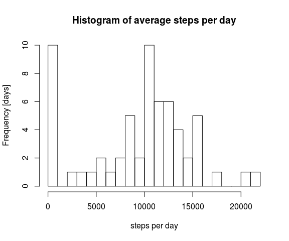
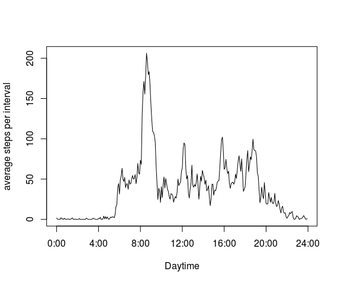
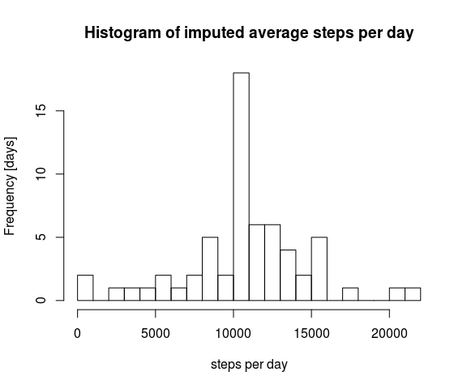
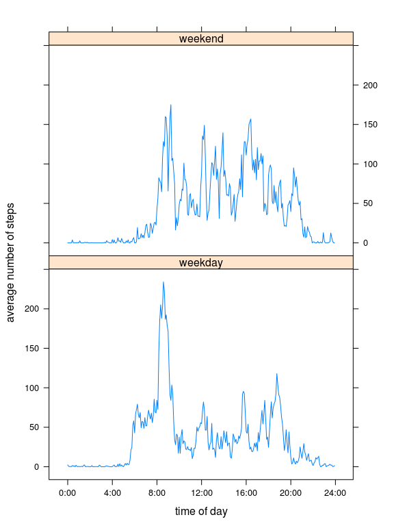

# Reproducible Research: Peer Assessment 1


## Loading and preprocessing the data

The interval identifiers in the dataset provided seem to be just hours and minutes fused together, so to obtain a meaningful interval time, these identifiers are converted to the overall starting minute of the interval (table column `int.minutes`). The date factor is converted to a data (column `dates`) and the weekday for each date extracted to a factor vector (column `weekday`):


```r
dataset <- read.csv(unz("repdata-data-activity.zip","activity.csv"))
dataset$dates <- as.Date(dataset$date)
dataset$int.minutes <- dataset$interval %% 100 + 60 * as.integer(dataset$interval/100)
dataset$weekday <- as.factor(weekdays(dataset$dates))
```

## What is the mean total number of steps taken per day?


```r
steps.per.day = unlist( by(dataset$steps,dataset$dates, 
                           function(x) sum(x,na.rm=TRUE),simplify=TRUE) )
summary.steps=summary(steps.per.day)
```

### Mean and median steps per day

Median steps per day: 10400

Mean steps per day: 9354

### Histogram of average steps per day


```r
hist(steps.per.day,breaks=25, main="Histogram of average steps per day", ylab = "Frequency [days]", xlab = "steps per day")
```

 

## What is the average daily activity pattern?


```r
avg.steps.per.interval=with(dataset,
                            aggregate(steps,list(int.minutes),
                                      function (x) mean(x,na.rm= TRUE),simplify=TRUE))
colnames(avg.steps.per.interval)=c("interval","avg.steps")
max.avg.steps = max(avg.steps.per.interval$avg.steps)
max.int = with(avg.steps.per.interval, interval[avg.steps == max.avg.steps])
```


```r
x.ticks=seq(0,24,by=4)
x.labs=paste(x.ticks,"00",sep=":")
plot(avg.steps.per.interval,type="l",xaxt="n",xlab="Daytime",ylab="average steps per interval")
axis(1,at=x.ticks*60,labels=x.labs)
```

 

### Maximum of number of average steps and time of maximum

Maximal number of average steps per interval: 206.1698113

At interval: 515 time: 8:35 


## Imputing missing values

### Get number of rows containing `NA` values


```r
na.rows=which(is.na(dataset$steps))
```

There are 2304 values missing out of a total of 17568. 

### Filling `NA` values with interval mean

For imputing intervals with missing values, the average of steps for each corresponding time interval was taken to replace the `NA` values. The imputed steps per interval are stored in the dataset in column `imp.steps`.


```r
dataset$imp.steps=dataset$steps
indeces = sapply(dataset$int.minutes[na.rows], 
                 function (x) which(avg.steps.per.interval$interval == x))
dataset$imp.steps[na.rows] = avg.steps.per.interval$avg.steps[ indeces]
imp.steps.per.day = unlist( by(dataset$imp.steps,dataset$dates, 
                           function(x) sum(x,na.rm=TRUE),simplify=TRUE) )
summary.imp.steps=summary(imp.steps.per.day)
```

### Histogram of steps per day of the imputed data set


```r
hist(imp.steps.per.day,breaks=25, main="Histogram of imputed average steps per day", ylab = "Frequency [days]", xlab = "steps per day")
```

 


### Median and mean steps per day of the imputed data set

Median steps per day: 10770

Mean steps per day: 10770

Compared to the raw step data, the imputed set - as is to be expected -  is shifted to higher average step values with higher mean and median. The mean and median become identical which could be due to removal of skew resulting from missing data.


## Are there differences in activity patterns between weekdays and weekends?

A new factor with levels `weekday` and `weekend` is created in the column `weekend`.


```r
dataset$weekend = as.factor(ifelse( dataset$weekday %in% c("Sunday","Saturday"),
                                    "weekend", "weekday" ) )
```

Calculating  average steps per interval for different values of `weekend`:


```r
avg.steps.per.int.weekday = with(dataset,
                            aggregate(steps,list(int.minutes,weekend),
                                      function (x) mean(x,na.rm= TRUE),simplify=TRUE))
colnames(avg.steps.per.int.weekday)=c("interval","weekend","avg.steps")
```


```r
library(lattice)
xyplot(avg.steps ~interval | weekend, data = avg.steps.per.int.weekday, type="l",
       horizontal = T,layout = c(1,2), ylab = "average number of steps", 
       xlab= "time of day", scales = list(x = list(at=x.ticks*60,labels = x.labs)) 
       )
```

 

